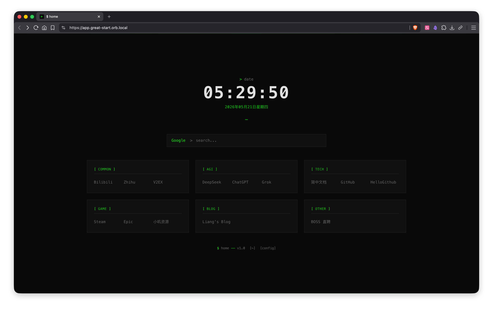

# great-start

一个简约的浏览器起始页，支持时钟、搜索引擎切换和书签管理。配置可远程备份至 GitHub Gist，实现多端同步。



| 功能 | 说明 |
|------|------|
| **时钟** | 实时日期时间，等宽字体显示 |
| **搜索引擎** | 支持多引擎切换，通过 `{keyword}` 模板自定义 |
| **书签** | 分组管理，YAML 编辑，支持导入/导出 |
| **Gist 备份** | 配置自动同步到 GitHub Gist，多端恢复 |

## Docker 部署

```bash
docker compose up -d --build
# 访问 http://localhost:3080
```

## Gist 备份

1. 在 [GitHub Settings > Tokens](https://github.com/settings/tokens) 创建 classic token，勾选 `gist` 权限
2. 打开页面，点击底部 `[~]`，输入 token 保存
3. 之后在 `[config]` 中编辑保存时，配置会自动推送到 Gist
4. 打开新页面时自动从 Gist 恢复

## 项目结构

```
app/
├── app.vue              # 入口
├── assets/main.css      # 全局样式
├── components/
│   ├── DateTime.vue     # 时钟
│   ├── SearchBox.vue    # 搜索引擎
│   ├── BookmarkBox.vue  # 书签
│   ├── ConfigEditor.vue # 配置编辑
│   └── GistBackup.vue   # 远程备份
└── composables/
    ├── useConfig.ts     # 配置管理
    └── useGistBackup.ts # Gist 同步
```

## 项目开发

```bash
pnpm dev       # 启动开发服务器
pnpm generate  # 构建静态站点到 dist/
pnpm build     # 构建 SSR 应用
```

## 技术栈

- **框架** — Nuxt 4 + Vue 3 + TypeScript
- **样式** — Tailwind CSS 6
- **存储** — localStorage（配置持久化）
- **远程** — GitHub Gist API（跨设备同步）
- **编辑** — js-yaml（YAML 格式配置编辑）
